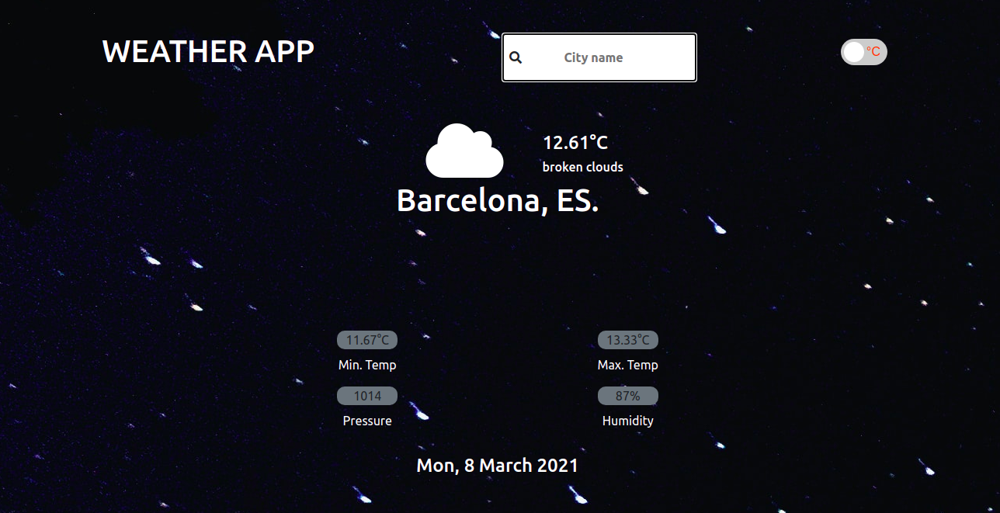

# Weather-app

> This app gives weather report of the chosen city.



## Built With

- HTML5 & CSS
- Bootstrap
- Vanilla JavaScript
- Webpack

## Live Demo

[Live Demo](https://weather-reports.netlify.app/)

## Getting Started

To get a local copy up and running follow these simple example steps.

# Instructions (Set Up)

Clone this repository in your computer

```
$  git clone git@github.com:Kingobaino1/Restaurant_page.git
```

```
$  Run in terminal `npm install` to install dependecies
```

```
$  To see it locally run `npm run build`.
```

Then open index.html in the dist folder to view it on the web.

## Author

👤 **Kingsley Ibeh**

- GitHub: [@githubhandle](https://github.com/Kingobaino1)
- Twitter: [@twitterhandle](https://twitter.com/ibehkingso)
- Linkedin: [@linkedinhandle](https://www.linkedin.com/in/kingsley-ibeh/)

## 🤝 Contributing

Contributions, issues and feature requests are welcome!
Feel free to check the issues page.

## Show your support

Give a ⭐️ if you like this project!

## Acknowledgments

- [Microverse](https://www.microverse.org/).
- [The Odin Project](https://www.theodinproject.com/).

## 📝 License

This project is [MIT licensed](/LICENSE).
